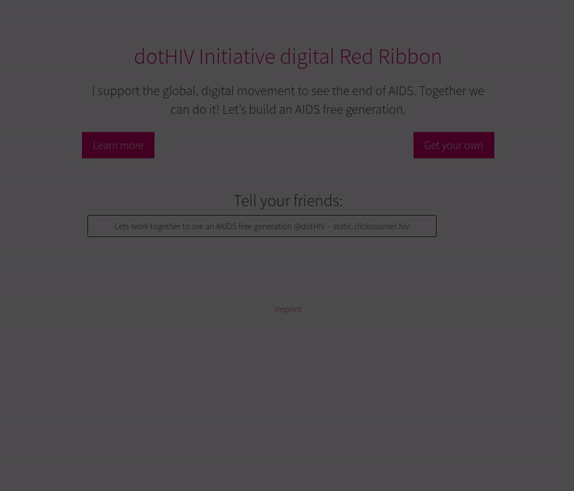

# the digital red ribbon

 

A static version of the the digital red ribbon, that replaces the click-counter.

You can find more information about the current state of the dotHIV project on [click4life.hiv](https://click4life.hiv/).

## Variants

The digital red ribbon is offered in two variants, the iFrame and the Microsite.

### Microsite

The Microsite is a single page website that domain owners can choose to display to visitors of their .hiv domain.

Example: http://static.clickcounter.hiv/microsite.html

### iFrame 

The iFrame wraps the target website and overlays the small message, after a few seconds it forwards the visitor to the target webpage.

Example: http://static.clickcounter.hiv/iframe.html

## Live

The ribbons are statically hosted, currently on `andromeda.hostedinspace.de`.

The configuration for each .hiv domain is managed in the Podio app [Digital Red Ribbon Configuration](https://podio.com/dothivorg/digital-red-ribbon/apps/digital-red-ribbon-configuration).

### Deployment

To update the ribbons, run the *deploy* target:

    PODIO__CLIENT_SECRET=… \
    PODIO__APP_TOKEN=… \
    make deploy
